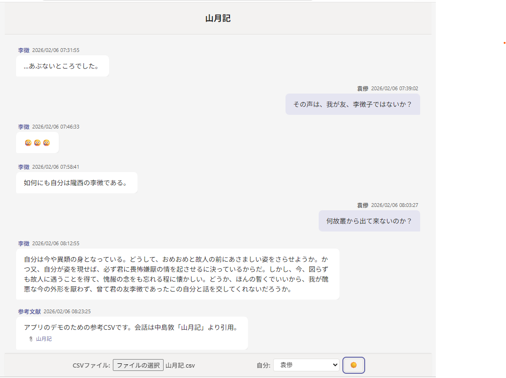

# Teams Chat CSV Viewer

## 説明

Microsoft Teams のチャット形式で CSV ファイルを表示するビュワーです。オフライン環境でも動作し、ブラウザで HTML ファイルを開くだけですぐに使えます。

## 特徴

- CSV ファイル（`DateTime`, `From`, `Content`, `Attachments` 形式）を読み込んで、Teams 風のチャット UI で表示
- ライト・ダーク・ハイコントラストのテーマの切り替え
- 送信者の中から「自分」を選んで、自分のメッセージを右寄せに表示
- 大容量の CSV ファイルでも軽快に動作（仮想レンダリング + 分割描画）
- 同一人物の連続投稿は間隔を狭くして会話の流れを見やすく表示
- ネットワークに接続なしのオフラインで動作します。

## 利用方法

### 単一ファイル版

1. [`teams-chat-csv-viewer.html`](teams-chat-csv-viewer.html) をブラウザで開きます。
2. 「CSVファイル」を選択、または drag & drop でチャット CSV ファイルを読み込みます。
3. 「自分」から自分の名前を選ぶと、その人のメッセージが右寄せになります。
4. テーマ切り替えボタン ☀️/🌙/🔳 でライト/ダーク/ハイコントラストのテーマを選択できます。

### 開発版（ソースファイル版）

```
index.html        # エントリーポイント
css/style.css     # スタイル（ライト/ダーク/ハイコントラストテーマ）
js/app.js         # アプリケーションロジック
```

`index.html` をブラウザで開くことで、単一ファイル版と同じ動作を確認できます。

### 単一ファイル版の生成

ソースファイルを変更した後、以下のコマンドで単一ファイル版を再生成できます。

```bash
node build_single_file.js
```

このコマンドは `index.html`、`css/style.css`、`js/app.js` の内容を統合し、`teams-chat-csv-viewer.html` を出力します。

## CSV の形式

```csv
"DateTime","From","Content","Attachments"
"2026/02/06 08:23:25","参考文献","アプリのデモのための参考CSVです。会話は中島敦「山月記」より引用。","https://ja.wikisource.org/wiki/%E5%B1%B1%E6%9C%88%E8%A8%98"
"2026/02/06 08:12:55","李徴","自分は今や異類の身となっている。どうして、おめおめと故人の前にあさましい姿をさらせようか。かつ又、自分が姿を現せば、必ず君に畏怖嫌厭の情を起させるに決っているからだ。しかし、今、図らずも故人に遇うことを得て、愧赧の念をも忘れる程に懐かしい。どうか、ほんの暫くでいいから、我が醜悪な今の外形を厭わず、曾て君の友李徴であったこの自分と話を交してくれないだろうか。",""
"2026/02/06 08:03:27","袁傪","何故叢から出て来ないのか？",""
"2026/02/06 07:58:41","李徴","如何にも自分は隴西の李徴である。",""
"2026/02/06 07:46:33","李徴","😢😢😢",""
"2026/02/06 07:39:02","袁傪","その声は、我が友、李徴子ではないか？",""
"2026/02/06 07:31:55","李徴","…あぶないところでした。",""
```

- 先頭行が最新のメッセージ、末尾が最も古いメッセージであることを想定しています。表示時に自動で時系列順（古→新）に並び替えられます。
- 引用符で囲まれたフィールドや、改行を含む `Content` にも対応しています。

## スクリーンショット




## 対応ブラウザ

- Google Chrome
- Microsoft Edge
- Mozilla Firefox
- Safari

最新の主要ブラウザで動作します。`content-visibility` CSS プロパティの性能向上効果を最大化するため、Chrome / Edge の最新版の使用を推奨します。

## License

This software is licensed under the MIT License.

## Acknowledgments

本プロジェクトの開発には「さくらの AI Engine」などの AI ツールの支援を利用しています。コードの設計判断および最終的な確認は作者が行っています。